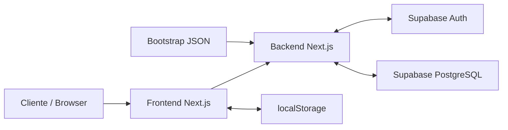
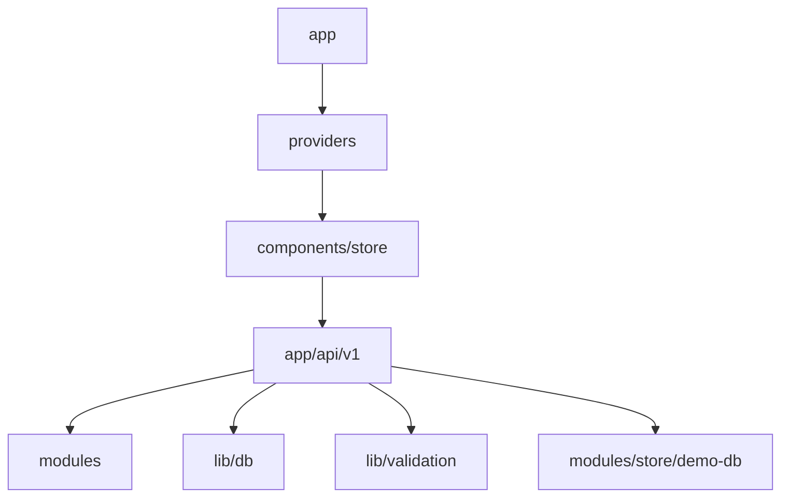
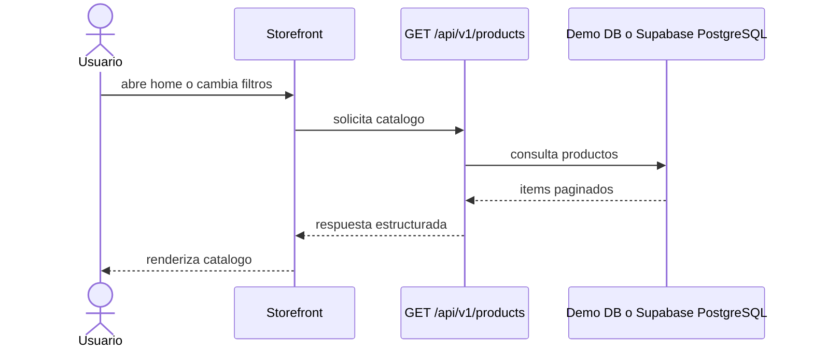
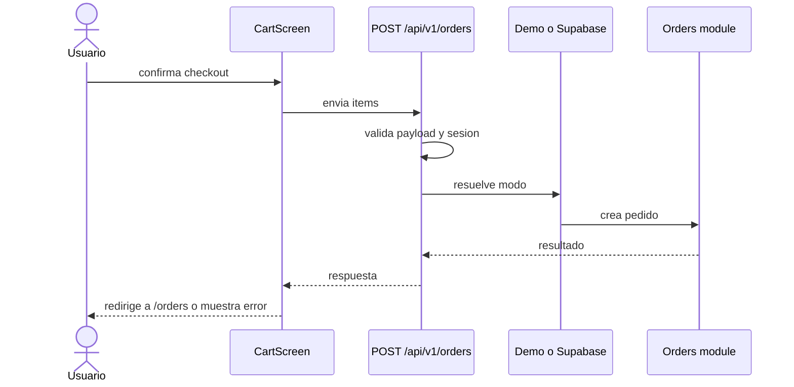
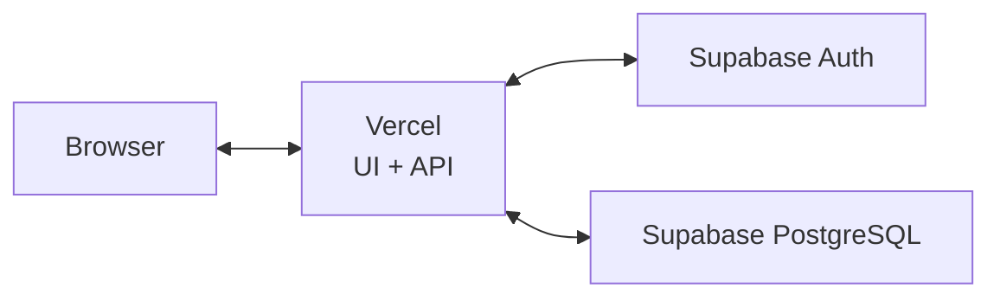

# PlootTest

PlootTest es una aplicacion e-commerce construida con `Next.js`, `React`, `Supabase`, `Zod`, `React Query` y `Playwright`. El proyecto ya cuenta con una capa funcional operativa para catalogo, carrito, autenticacion, checkout y consulta de pedidos, con soporte tanto para modo demo como para integracion real con Supabase.

Documentos principales:

- Guia operativa del proyecto: [README_project.md](/Users/cruiiz/Git/plootTest/README_project.md)
- Documento arquitectonico completo: [arquitectura-del-sistema.md](/Users/cruiiz/Git/plootTest/docs/arquitectura-del-sistema.md)
- Roadmap: [roadmap.md](/Users/cruiiz/Git/plootTest/docs/roadmap/roadmap.md)

## Arquitectura

### Resumen

El sistema se organiza en estos bloques:

- `Frontend Next.js`: storefront, carrito, auth y pedidos
- `Backend Next.js`: App Router y endpoints `/api/v1`
- `Supabase Auth`: magic link y sesiones
- `Supabase PostgreSQL`: productos, pedidos, lineas y stock
- `localStorage`: persistencia temporal del carrito
- `Bootstrap JSON`: carga inicial del catalogo

### Componentes Principales

| Componente | Responsabilidad | Estado |
| --- | --- | --- |
| Frontend Storefront | catalogo, carrito, auth y vistas de pedidos | implementado |
| Backend API | validacion, coordinacion de dominio y respuestas HTTP | implementado |
| Catalogo | listado, busqueda, filtros y paginacion | implementado |
| Carrito | estado local y persistencia en navegador | implementado |
| Auth | login por magic link y resolucion de sesion | implementado |
| Checkout/Pedidos | creacion y consulta de pedidos | implementado |
| Integracion Supabase | auth, DB y checkout persistente | implementado |
| Demo fallback | soporte local para desarrollo y pruebas | implementado |

### Vista Estatica

### Vista Dinamica

#### Catalogo

#### Checkout

### Despliegue

El sistema se despliega como una unica aplicacion Next.js en `Vercel`, conectada a `Supabase` para autenticacion y persistencia.

## Estado Actual

Ya implementado:

- catalogo con busqueda, filtros, orden y paginacion
- carrito persistido en `localStorage`
- login por magic link
- checkout en modo demo y en modo Supabase
- consulta de pedidos
- testing base con `Vitest`, `Playwright` y snapshots visuales

Siguiente enfoque:

- reforzar atomicidad del checkout persistente
- endurecer errores y validaciones del flujo real
- ampliar pruebas sobre Supabase real
- mejorar observabilidad operativa

## Mas Detalle

Para desarrollo diario y comandos del proyecto, consulta [README_project.md](/Users/cruiiz/Git/plootTest/README_project.md).

Para la arquitectura completa con vistas estaticas, dinamicas y despliegue, consulta [arquitectura-del-sistema.md](/Users/cruiiz/Git/plootTest/docs/arquitectura-del-sistema.md).
