# PlootTest

Repositorio monorepo de una aplicacion web construida con `Next.js`, `React`, `Supabase`, `Zod`, `React Query`, `Playwright`, `pnpm` y `Turborepo`.

## Requisitos previos

- `Node.js >= 20`
- proyecto de `Supabase`
- variables de entorno configuradas

## Variables de entorno

```env
NEXT_PUBLIC_SUPABASE_URL=
NEXT_PUBLIC_SUPABASE_ANON_KEY=
SUPABASE_SERVICE_ROLE_KEY=
```

## Instalacion

```bash
pnpm install
```

## Ejecucion

Desarrollo:

```bash
pnpm dev
```

Build de produccion:

```bash
pnpm build
```

Arranque en modo produccion:

```bash
pnpm start
```

## Scripts

```bash
pnpm dev
```

Levanta la aplicacion en desarrollo.

```bash
pnpm build
```

Genera el build de produccion.

```bash
pnpm start
```

Ejecuta la aplicacion con el build generado.

```bash
pnpm lint
```

Ejecuta `eslint`.

```bash
pnpm typecheck
```

Ejecuta validacion de tipos con `tsc --noEmit`.

```bash
pnpm test
```

Ejecuta la suite de tests unitarios con `Vitest`.

```bash
pnpm test:watch
```

Ejecuta `Vitest` en modo watch.

```bash
pnpm test:e2e
```

Genera build y ejecuta tests E2E con `Playwright`.

```bash
pnpm test:ui
```

Genera build y actualiza snapshots visuales del test E2E base.

```bash
pnpm seed:products
```

Carga el catalogo inicial desde el seed JSON.

## Base de datos y seed

- Esquema SQL: [schema.sql](/Users/cruiiz/Git/plootTest/apps/web/supabase/schema.sql)
- Seed de productos: [products.seed.json](/Users/cruiiz/Git/plootTest/apps/web/src/lib/data/products.seed.json)
- Script de carga: [seed-products.ts](/Users/cruiiz/Git/plootTest/apps/web/scripts/seed-products.ts)

## Estructura del proyecto

```text
apps/
  web/
    src/        # app Next.js
    tests/      # pruebas unitarias, E2E y setup
    scripts/    # scripts auxiliares
    supabase/   # esquema y recursos de base de datos

packages/
  config-eslint/
  config-typescript/

docs/           # documentacion formal del proyecto
```

## Documentacion

La documentacion del proyecto esta en [docs](/Users/cruiiz/Git/plootTest/docs/).


# Arquitectura del Sistema

## 1. Introduccion y objetivos

### 1.1 Proposito

Este documento describe la arquitectura del estado actual del sistema. Hoy el proyecto ya cuenta con una base tecnica ejecutable y con una primera capa funcional operativa: catalogo, carrito, autenticacion, checkout y consulta de pedidos, tanto con soporte demo como con integracion real con Supabase. El trabajo posterior se centra en endurecimiento, robustez transaccional y ampliacion de pruebas.

Decision de velocidad:

- `localStorage` se usa para el carrito y el estado temporal del cliente
- `Supabase` se usa para autenticacion, productos y pedidos persistentes

### 1.2 Alcance

Estado actual implementado:

- app Next.js operativa con pantalla base
- catalogo de productos con busqueda, filtros y paginacion
- carrito persistido en cliente
- autenticacion por magic link
- checkout funcional en modo demo
- checkout funcional en modo Supabase
- consulta de pedidos del usuario
- API minima para productos y pedidos
- validacion de variables de entorno
- clientes de Supabase para navegador, servidor y admin
- carga inicial de productos desde archivos `.json`
- esquema SQL base para productos, pedidos y lineas
- contratos Zod compartidos
- helpers HTTP compartidos
- testing base con Vitest, Playwright y snapshot visual

Siguiente alcance funcional:

- reforzar atomicidad y consistencia del checkout persistente
- endurecer errores estructurados del flujo de compra
- ampliar pruebas sobre el flujo real con Supabase
- mejorar observabilidad operativa del sistema

Requerimientos relacionados:

- RF-001
- RF-002
- RF-005
- RF-006
- RF-007
- RF-008
- RF-009
- RF-011
- RF-014
- RF-015
- RF-016
- RF-019

Quedan fuera del alcance inicial:

- pagos reales
- social login
- webhooks
- observabilidad avanzada
- arquitectura distribuida

Como evolucion posterior, el sistema contempla una ruta de escalado para soportar mayor volumen de uso sin formar parte del alcance base.

Documentos de referencia:

- `docs/requisitos/requerimientos-funcionales.md`
- `docs/requisitos/requerimientos-no-funcionales.md`

### 1.3 Objetivos de calidad

| Prioridad | Meta de calidad | Escenario concreto |
| --- | --- | --- |
| Alta | Consistencia de datos | un checkout concurrente no debe generar stock negativo ni pedidos incompletos |
| Alta | Seguridad de acceso | un usuario autenticado no puede consultar pedidos ajenos |
| Alta | Simplicidad operativa | la aplicacion debe poder desplegarse en Vercel con Supabase como unico servicio externo principal |
| Media | Validacion de contratos | payloads invalidos deben fallar antes de ejecutar logica de negocio |
| Media | Confianza en cambios | pruebas automatizadas deben detectar regresiones funcionales y visuales antes del despliegue |

### 1.4 Stakeholders

| Stakeholder | Interes | Expectativa sobre la arquitectura |
| --- | --- | --- |
| Usuario final | comprar de forma sencilla y fiable | catalogo rapido, checkout estable y acceso a sus pedidos |
| Equipo de desarrollo | entregar y mantener la solucion | base simple, decisiones explicitas y testing suficiente para cambiar con confianza |
| Negocio y operaciones | poner el producto en marcha rapido | despliegue simple en Vercel, bajo coste operativo y evolucion progresiva |

## 2. Restricciones de arquitectura

- una sola base de codigo
- frontend y backend en el mismo repositorio
- frontend implementado con React
- framework principal basado en Next.js App Router
- libreria de componentes basada en shadcn/ui
- stack principal basado en TypeScript
- integracion con Supabase para autenticacion y persistencia
- despliegue principal sobre Vercel
- prioridad a simplicidad operativa, mantenibilidad y consistencia de negocio

## 3. Contexto y alcance del sistema

### 3.1 Contexto de negocio

El sistema permite a un usuario explorar un catalogo, añadir productos al carrito y generar un pedido siempre que exista stock suficiente. Una vez autenticado, el usuario puede consultar sus pedidos.

Actores de negocio:

| Actor | Interaccion principal | Resultado esperado |
| --- | --- | --- |
| Cliente | consulta catalogo, gestiona carrito y compra | pedido valido y consulta de su historial |
| Negocio | define catalogo inicial | productos disponibles para la primera version |
| Equipo de desarrollo | evoluciona y despliega la solucion | cambios controlados y trazables |

### 3.2 Contexto tecnico

Actores y sistemas externos:

- archivos `.json`: fuente inicial para la carga de productos en la primera version
- navegador web: consume la aplicacion y mantiene el carrito en `localStorage`
- aplicacion web Next.js: renderiza interfaz y expone endpoints
- Supabase Auth: autentica usuarios
- Supabase/PostgreSQL: persiste productos, pedidos y stock, pero no el carrito de la primera version
- shadcn/ui: base de componentes para la interfaz

Partners tecnicos externos:

| Partner | Tipo | Interfaz | Proposito |
| --- | --- | --- | --- |
| Archivos `.json` | fuente de datos interna | carga inicial | bootstrap del catalogo |
| Navegador | cliente | HTTP y almacenamiento local | consumo de UI y persistencia temporal del carrito |
| Vercel | plataforma | despliegue de app Next.js | hosting de UI y endpoints |
| Supabase Auth | servicio externo | cliente auth | autenticacion y sesion |
| Supabase PostgreSQL | servicio externo | cliente de datos | persistencia de productos, pedidos y stock |

### 3.3 Interfaces externas

- `GET /api/v1/products`
- `POST /api/v1/orders`
- `GET /api/v1/orders`

Descripcion de interfaces:

| Interfaz | Proposito |
| --- | --- |
| `GET /api/v1/products` | consultar catalogo con busqueda, filtros y paginacion |
| `POST /api/v1/orders` | crear un pedido validando autenticacion y stock |
| `GET /api/v1/orders` | consultar pedidos del usuario autenticado |

Requerimientos relacionados:

- RF-014
- RF-015
- RF-016
- RF-017
- RF-018

## 4. Estrategia de solucion

### 4.1 Enfoque general

Se adopta un monolito simple implementado con Next.js. Esta eleccion ha permitido construir primero una plataforma ejecutable y deja el dominio funcional preparado para completarse por fases.

### 4.2 Stack tecnologico

| Tecnologia | Rol | Version objetivo |
| --- | --- | --- |
| Node.js | runtime de desarrollo y build | 20.x |
| Next.js App Router | framework full stack para UI, routing y endpoints | 15.x |
| React | composicion de interfaz y componentes | 19.x |
| TypeScript | tipado estatico y contratos entre capas | 5.x |
| Supabase | autenticacion, sesion y persistencia relacional | 2.x cliente JS |
| shadcn/ui | libreria base de componentes de interfaz | ultima compatible |
| React Query | estado remoto, cache y sincronizacion | 5.x |
| Zod | validacion de contratos de entrada y salida | 3.x |
| Playwright | pruebas E2E y regresion visual | 1.x |
| Vercel | despliegue de la aplicacion y endpoints | gestionado por plataforma |

### 4.3 Decisiones principales

- precios en enteros mediante `price_cents`
- snapshot de precio en `order_items`
- UUIDs para entidades publicas
- validacion de entrada en API con Zod
- ownership validation en endpoints protegidos
- logica critica de stock cercana a la base de datos
- carrito persistido en `localStorage` para acelerar la primera version
- carga inicial del catalogo desde `.json` para reducir friccion de arranque
- Supabase no gestiona el carrito en la primera version

Requerimientos relacionados:

- RF-001
- RF-007
- RF-008
- RF-009
- RF-010
- RF-017
- RNF-001
- RNF-003
- RNF-011

Tabla de decisiones:

| Decision | Motivo | Impacto |
| --- | --- | --- |
| Monolito simple | acelerar la primera version | menos complejidad estructural inicial |
| `localStorage` para carrito | resolver rapido el estado temporal | sin sincronizacion multi-dispositivo |
| Bootstrap desde `.json` | reducir friccion de arranque | catalogo inicial rapido, sin backoffice |
| Supabase como BaaS | simplificar auth y persistencia | dependencia de plataforma |
| Despliegue en Vercel | simplificar operacion | integracion natural con Next.js |
| Testing con unit + Playwright + snapshots | reducir regresiones | coste de mantenimiento de pruebas |

### 4.4 Estrategia de desarrollo

Estado actual:

- base del proyecto e integracion con Supabase completadas
- bootstrap de productos desde `.json` disponible
- validaciones y testing base disponibles
- catalogo, carrito, autenticacion y consulta de pedidos ya operativos
- checkout disponible en modo demo y en modo Supabase

Siguiente fase:

1. reforzar atomicidad y consistencia del checkout real
2. endurecer errores y validaciones del flujo autenticado
3. ampliar pruebas sobre el flujo real de compra
4. mejorar observabilidad de diagnostico en produccion

Todo lo demas queda como evolucion posterior.

## 5. Vista estatica

### 5.1 Arquitectura de alto nivel

El sistema se organiza en cuatro bloques principales:

- `Frontend Next.js`: storefront, carrito, auth y pedidos
- `Backend Next.js`: endpoints HTTP y logica de aplicacion
- `Supabase`: autenticacion y persistencia real
- `Cliente`: navegador y `localStorage` para estado temporal

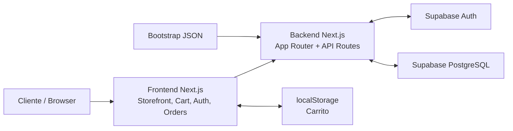

### 5.2 Componentes principales del sistema

| Componente | Tipo | Responsabilidad | Estado |
| --- | --- | --- | --- |
| Frontend Storefront | cliente | mostrar catalogo, filtros, carrito y vistas de usuario | implementado |
| Backend API | servidor | exponer endpoints y coordinar validacion y dominio | implementado |
| Catalogo | dominio | consulta de productos, filtros, busqueda y paginacion | implementado |
| Carrito | dominio cliente | gestionar items y persistirlos en `localStorage` | implementado |
| Auth | dominio | login por magic link y resolucion de sesion | implementado |
| Checkout/Pedidos | dominio | crear pedidos y consultar historial | implementado |
| Integracion Supabase | infraestructura | auth, DB y RPC de checkout | implementado |
| Demo fallback | infraestructura | datos y sesiones locales para desarrollo | implementado |
| Bootstrap inicial | soporte operativo | cargar catalogo inicial desde `.json` | implementado |

### 5.3 Whitebox del frontend

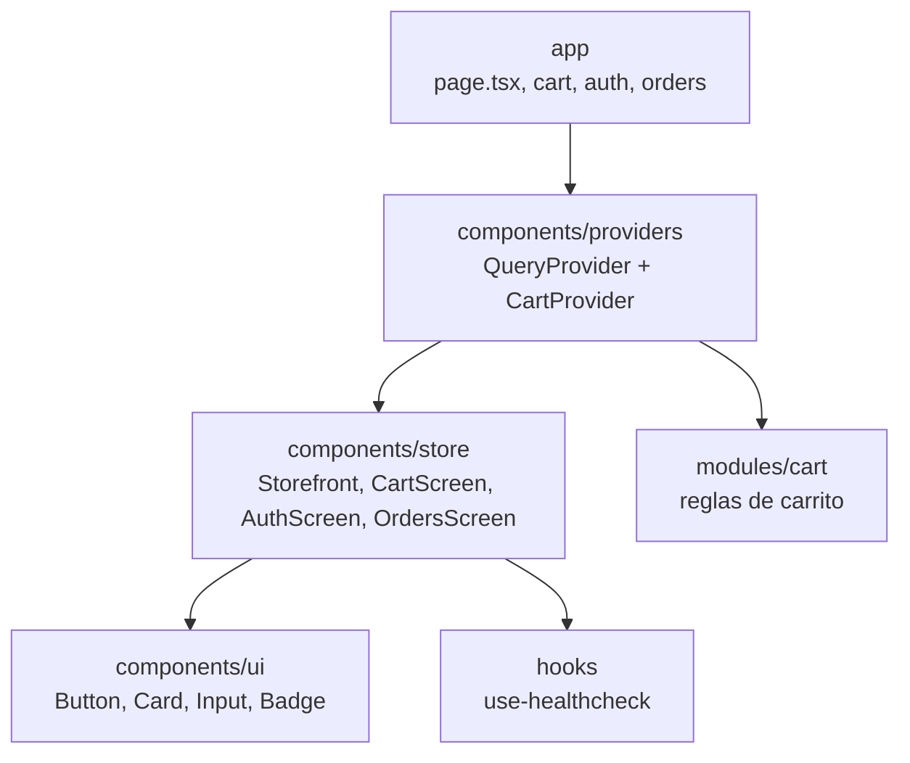

| Bloque | Responsabilidad |
| --- | --- |
| `app` | entrypoints de paginas y rutas del App Router |
| `components/providers` | contexto global de React Query y carrito |
| `components/store` | pantallas funcionales del producto |
| `components/ui` | primitives reutilizables de interfaz |
| `hooks` | hooks auxiliares de cliente |

### 5.4 Whitebox del backend

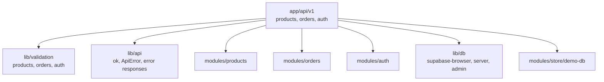

| Bloque | Responsabilidad |
| --- | --- |
| `app/api/v1` | adaptadores HTTP del sistema |
| `lib/validation` | contratos Zod de entrada y salida |
| `lib/api` | respuestas estructuradas y errores |
| `lib/db` | clientes de Supabase para browser, server y admin |
| `modules/products` | query parsing y filtrado/catalogo |
| `modules/orders` | checkout, listado y acceso a pedidos |
| `modules/auth` | sesion, logout y utilidades de usuario |
| `modules/store/demo-db` | fallback local para desarrollo y pruebas |

### 5.5 Whitebox de integraciones y persistencia

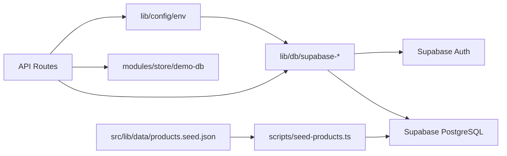

Esta vista deja claro que el sistema soporta dos caminos operativos:

- `modo Supabase`: usa auth y base de datos reales
- `modo demo`: usa `demo-db` y sesion local cuando no hay configuracion o se fuerza el fallback

### 5.6 Dominio critico: checkout y pedidos

El dominio de pedidos concentra el mayor riesgo tecnico del sistema porque afecta autenticacion, stock y persistencia.

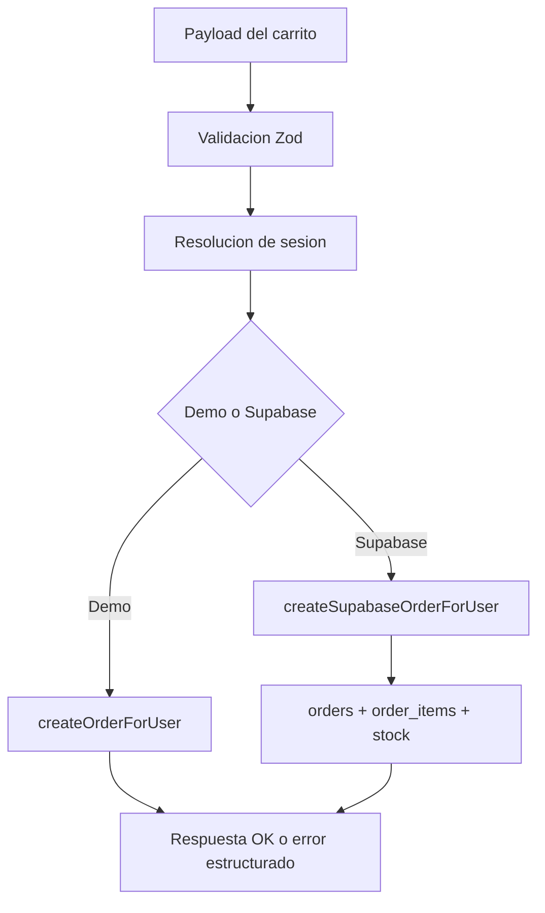

| Paso | Responsabilidad |
| --- | --- |
| Validacion | validar payload del checkout antes de operar |
| Sesion | resolver usuario actual en demo o Supabase |
| Seleccion de modo | elegir flujo demo o flujo persistente real |
| Checkout | crear pedido y lineas correspondientes |
| Persistencia | mantener consistencia entre pedido, lineas y stock |

## 6. Vista dinamica

### 6.1 Catalogo

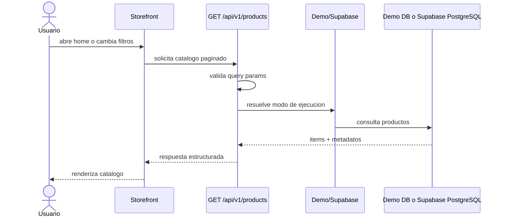

Resultado esperado:

- listado paginado con busqueda, orden y filtro de stock

Errores relevantes:

- query invalida
- fallo de lectura de datos

Requerimientos relacionados:

- RF-002
- RF-003
- RF-004
- RF-014
- RNF-006

### 6.2 Login con magic link

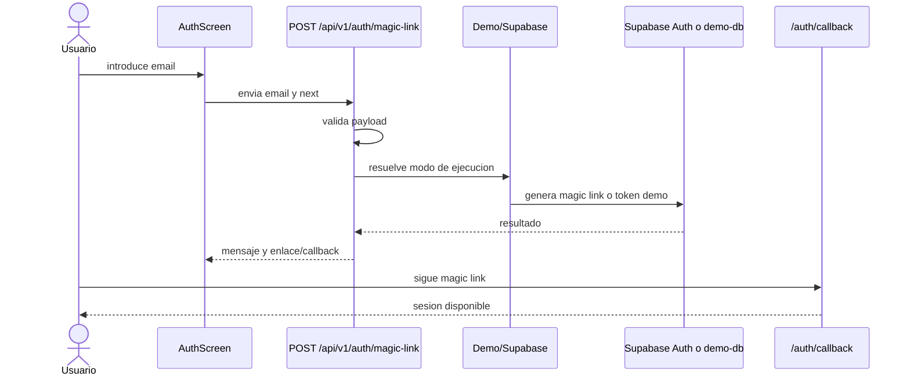

Resultado esperado:

- usuario autenticado y redirigido a la siguiente pantalla

Errores relevantes:

- email invalido
- fallo del proveedor auth

### 6.3 Checkout

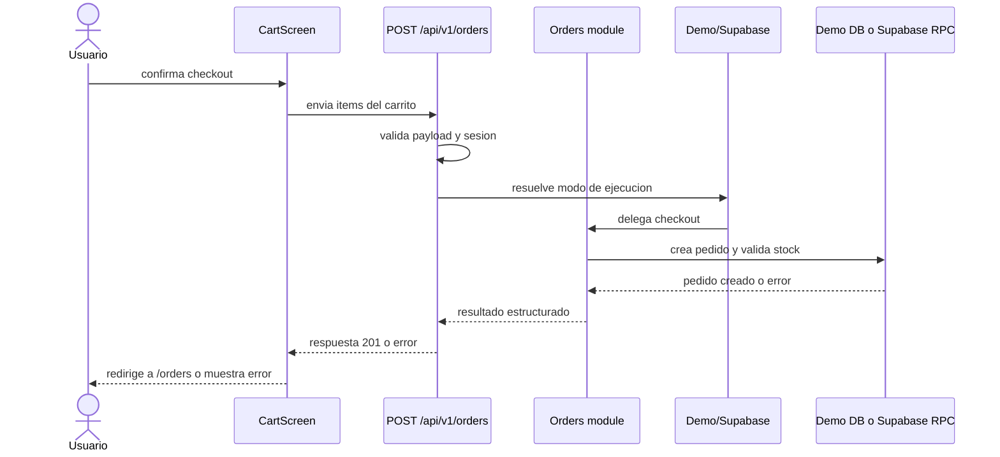

Resultado esperado:

- pedido creado y carrito vaciado

Errores relevantes:

- usuario no autenticado
- payload invalido
- stock insuficiente
- fallo de persistencia

Requerimientos relacionados:

- RF-007
- RF-008
- RF-009
- RF-010
- RF-017
- RNF-001
- RNF-002
- RNF-011

### 6.4 Consulta de pedidos

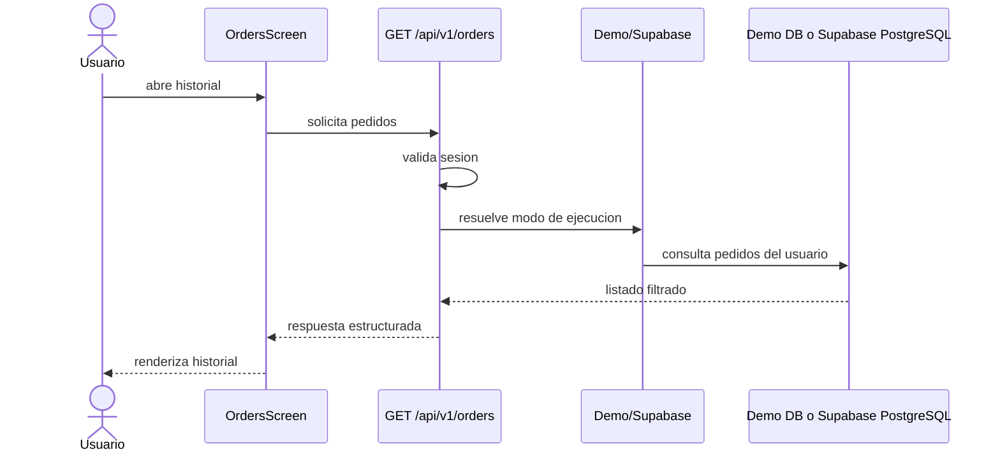

Resultado esperado:

- listado exclusivo de pedidos del usuario actual

Errores relevantes:

- sesion invalida
- acceso no autorizado
- fallo de lectura

Requerimientos relacionados:

- RF-011
- RF-012
- RF-016
- RNF-002

### 6.5 Bootstrap inicial desde JSON

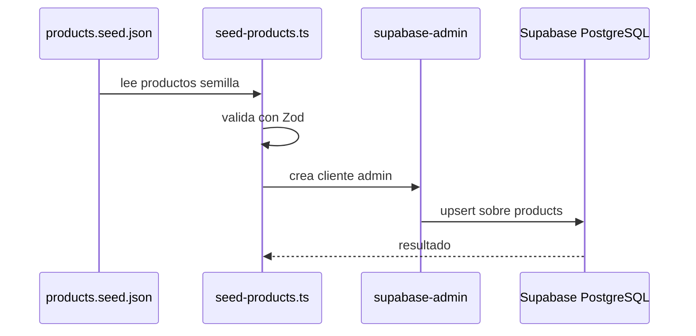

Resultado esperado:

- catalogo inicial disponible en la tabla `products`

Errores relevantes:

- archivo invalido
- error de validacion
- fallo de escritura en DB

Requerimientos relacionados:

- RF-001

## 7. Vista de despliegue

### 7.1 Arquitectura de despliegue

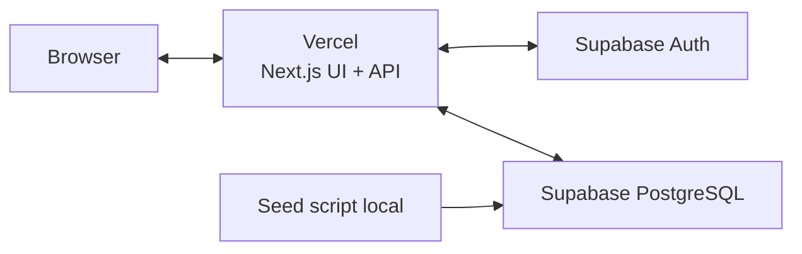

### 7.2 Nodos y responsabilidades

| Nodo | Responsabilidad |
| --- | --- |
| Browser | ejecutar UI, mantener carrito en `localStorage` y consumir la API |
| Vercel | alojar paginas, componentes del App Router y endpoints |
| Supabase Auth | gestionar magic link, sesiones e identidad |
| Supabase PostgreSQL | persistir productos, pedidos, lineas y stock |
| Seed script | inicializar catalogo desde `.json` |

### 7.3 Mapeo de bloques a infraestructura

| Bloque | Destino |
| --- | --- |
| Frontend Next.js | Vercel |
| Endpoints App Router | Vercel |
| Auth | Supabase Auth |
| Productos, pedidos y stock | Supabase PostgreSQL |
| Carrito temporal | Browser `localStorage` |
| Bootstrap desde `.json` | script operativo del repositorio |

### 7.4 Entornos

| Entorno | Proposito |
| --- | --- |
| Local | desarrollo, demo mode y pruebas de integracion |
| Produccion | aplicacion publicada en Vercel conectada a Supabase |

### 7.5 Consideraciones operativas

- Vercel aloja la interfaz y los endpoints del sistema
- Supabase aloja autenticacion y base de datos
- `localStorage` solo se usa para estado temporal del carrito
- el despliegue requiere variables de entorno para URL y claves de Supabase

## 8. Conceptos transversales

### 8.1 Validacion

Todos los contratos de entrada de API deben validarse con Zod antes de invocar logica de negocio.

Requerimientos relacionados:

- RF-017
- RNF-003

### 8.2 Seguridad

- autenticacion obligatoria para pedidos
- validacion de ownership
- no confiar en precios ni totales calculados por el cliente

Requerimientos relacionados:

- RF-007
- RF-011
- RF-012
- RNF-002

### 8.3 Gestion de errores

Los endpoints deben responder con errores estructurados, distinguendo entre:

- error de validacion
- error de autenticacion
- error de autorizacion
- error de stock insuficiente
- error interno

Requerimientos relacionados:

- RF-018
- RNF-008

### 8.4 Gestion de estado

- estado remoto con React Query
- estado local del carrito con `localStorage`

Requerimientos relacionados:

- RF-006
- RNF-007

Decision aplicada:

- `localStorage` es la opcion elegida por velocidad de implementacion
- no se sincroniza carrito contra Supabase en esta version

### 8.5 Persistencia

Modelo principal:

- `products`
- `orders`
- `order_items`

Requerimientos relacionados:

- RF-001
- RF-009
- RF-010
- RNF-011

### 8.6 Carga inicial

La primera carga del sistema se realiza desde archivos `.json` para acelerar el arranque del catalogo. Esta estrategia solo cubre la inicializacion de la primera version y no sustituye futuras capacidades de importacion o administracion.

Requerimientos relacionados:

- RF-001

### 8.7 Testing

La estrategia de testing del sistema combina:

- unit tests para logica de negocio, validaciones y componentes criticos
- Playwright E2E para flujos principales
- snapshots visuales para detectar regresiones no intencionales en UI

Esta estrategia cubre tanto el boilerplate del MVP como los flujos funcionales implementados despues.

Que resuelve:

- reduce regresiones funcionales y visuales

Como se aplica:

- unit tests para logica y componentes
- Playwright para flujos y comparaciones visuales

Que queda fuera por ahora:

- infraestructura avanzada de testing distribuido
- tooling visual adicional mas alla de snapshots base

Requerimientos relacionados:

- RNF-016
- RNF-017
- RNF-018

## 9. Decisiones de arquitectura

Las decisiones formales se documentan en `docs/ADR/`.

ADRs vigentes del sistema:

- ADR-001: monolito vs monolito modular
- ADR-002: decision de alcance de la primera version
- ADR-003: carrito persistido en cliente
- ADR-004: despliegue sobre Vercel
- ADR-005: estrategia de desarrollo por fases
- ADR-006: Supabase como BaaS
- ADR-007: carga inicial desde `.json`
- ADR-008: estrategia de testing

## 10. Requisitos de calidad

### 10.1 Consistencia

No deben generarse pedidos con stock negativo por condiciones evitables de concurrencia.

Requerimientos relacionados:

- RNF-001

### 10.2 Rendimiento

Se busca una experiencia correcta para catalogo con:

- indices de base de datos
- busqueda con debounce
- paginacion
- cache de React Query

Requerimientos relacionados:

- RNF-006

Escenario de calidad:

- una consulta tipica de catalogo debe responder de forma razonable con paginacion y busqueda activa

### 10.3 Escalabilidad

La escalabilidad avanzada queda fuera del alcance base y se aborda despues de disponer de una aplicacion funcional desplegada.

Requerimientos relacionados:

- RNF-009
- RNF-015

### 10.4 Mantenibilidad

La logica de negocio debe quedar separada de UI y de los adaptadores HTTP.

Requerimientos relacionados:

- RNF-004
- RNF-013

### 10.5 Seguridad

Un usuario no puede consultar pedidos ajenos ni crear pedidos sin autenticacion.

Requerimientos relacionados:

- RNF-002

### 10.6 Testing y regresion

La solucion debe contar con una estrategia de pruebas que reduzca regresiones funcionales y visuales, y que permita validar cambios con rapidez antes del despliegue.

Requerimientos relacionados:

- RNF-016
- RNF-017
- RNF-018

Escenarios de calidad:

- una regression en checkout debe ser detectable por tests automatizados
- un cambio visual no intencional en catalogo, carrito o checkout debe ser detectable por snapshots

Estado actual:

- unit tests base implementados
- E2E base implementado sobre la home
- snapshot visual base implementado sobre la home

## 11. Riesgos y deuda tecnica

| Riesgo o deuda | Impacto | Mitigacion | Estado |
| --- | --- | --- | --- |
| concurrencia de stock | pedidos inconsistentes | reforzar estrategia transaccional en checkout | abierto |
| carrito en cliente no sincronizado | experiencia limitada entre dispositivos | mantenerlo asi en primera version y revisar despues | aceptado |
| bootstrap desde `.json` limitado | no cubre administracion continua | evolucionar a importacion o backoffice si el producto crece | abierto |
| dependencia de Supabase | condiciona portabilidad | aislar acceso a datos y auth en capas propias | aceptado |
| snapshots visuales con mantenimiento | ruido en cambios UI | revisar cambios visuales intencionales con disciplina | abierto |
| escalado x100 fuera del alcance base | capacidad limitada ante crecimiento | tratarlo como fase posterior con cache, replicas y observabilidad | aceptado |

## 12. Evolucion futura de arquitectura

La arquitectura actual prioriza una entrega vertical simple, operativa y desplegable. Aun asi, el sistema deja abierta una evolucion posterior hacia capacidades mas avanzadas una vez quede cerrado el flujo real de compra.

Direccion de evolucion deseada:

- procesamiento asincrono para pedidos, stock y notificaciones mediante colas o workers
- eventos de dominio como `OrderCreated`, `StockUpdated` o `PaymentConfirmed`
- modularizacion progresiva de dominios como catalogo, pedidos y usuarios
- observabilidad avanzada con logs estructurados y trazas
- integraciones futuras con servicios externos, analytics o automatizaciones

Estas capacidades no forman parte del alcance actual ni del siguiente desarrollo prioritario, pero sirven como guia para evolucionar el sistema sin romper la base existente.

## 13. Glosario

- catalogo: conjunto de productos disponibles para compra
- carrito: seleccion temporal de productos en cliente
- checkout: proceso de validacion y creacion del pedido
- ownership: validacion de que un recurso pertenece al usuario autenticado
- snapshot de precio: copia del precio del producto en el momento de compra
